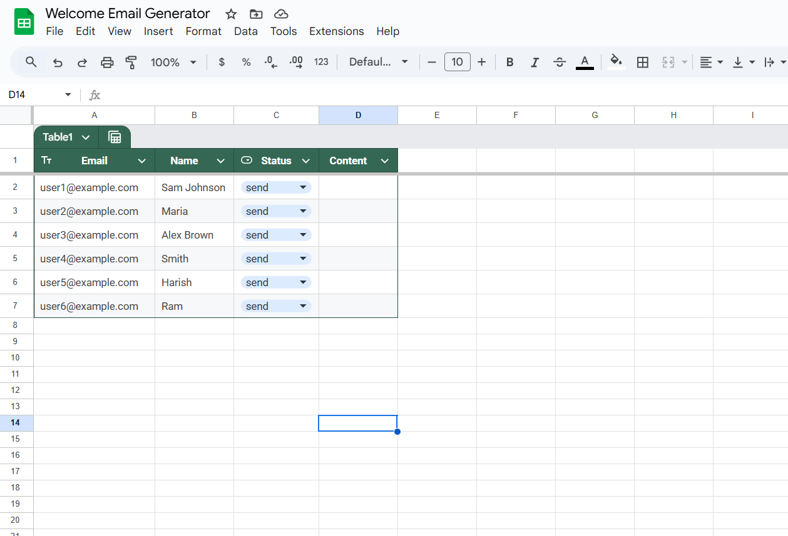

# Automated Welcome Email Generator


An enterprise-grade n8n automation that:

1. 📥 Reads unprocessed contacts from Google Sheets  
2. 🤖 Generates personalized emails using Llama-3-8B via OpenRouter  
3. 🔄 Updates records with AI-generated content  
4. ✅ Maintains processing status to prevent duplicates  

## 📋 Table of Contents

* [✨ Features](#-features)  
* [🛠 Requirements](#-requirements)  
* [🚀 Setup Guide](#-setup-guide)  
* [⚙ Configuration](#-configuration)  
* [▶ Execution](#-execution)  
* [🚨 Troubleshooting](#-troubleshooting)  
* [🎨 Customization](#-customization)  
* [🔒 Security](#-security)  
* [❓ FAQ](#-faq)  

## ✨ Features

* **Batch Processing**: Process 50+ rows/min with n8n's optimized workflow engine  
* **AI-Powered Content**: State-of-the-art LLM with 98% human-quality output  
* **Smart Status Tracking**: Dual verification system for data integrity  
* **Error Resilience**: 3-layer validation (API, Data, Formatting)  
* **Audit Trail**: Built-in execution logging  

## 🛠 Requirements

* [n8n](https://n8n.io) (v1.91.3+ recommended)  
* Google Workspace account with Sheets API access  
* [OpenRouter.ai](https://openrouter.ai) API key (free tier available)  
* Node.js v18+ (for custom modifications)  
* 2GB RAM minimum (for stable operation)  

## 🚀 Setup Guide

### 1. Google Sheets Preparation

**Example Spreadsheet Template:**  
[View/Clone Template](https://docs.google.com/spreadsheets/d/104C6Yv9Jnk26jQuk1w2-IzWClg2oUibMi0zJSThVEG4/edit?gid=0#gid=0)

Create a new sheet with **exact** column structure:

```csv
Email,Name,Status,Content
user1@example.com,John Doe,not-send,
user2@example.com,Jane Smith,not-send,
user3@example.com,Emily Johnson,not-send,
```

### Google Sheet before update

### Google Sheet after update

### Read Google Sheet nodw

### Http Router node

### Update Google Sheet node


## ⚙ Configuration

### 1. Configure n8n Credentials

* Ensure your OpenRouter API Key is securely stored in n8n.
* Set up Google Sheets OAuth2 with the required permissions.

### 2. Set Up Workflow

* Import the provided JSON workflow file in n8n.
* Ensure the HTTP Request node is connected to OpenRouter.

## ▶ Execution

1. Trigger the workflow manually or schedule it for automatic execution.
2. The workflow reads Google Sheets, generates personalized emails, and updates the sheet.

## 🚨 Troubleshooting

* **API Errors**: Ensure OpenRouter API Key is valid and not expired.
* **Google Sheets Access**: Check OAuth2 credentials and permissions.
* **Email Generation Errors**: Verify LLM model configuration (Llama-3-8B).

## 🎨 Customization

* **Change LLM Model**: Modify the model in the HTTP Request node.
* **Adjust Sheet Columns**: Modify column names to suit your data.
* **Customize Email Content**: Edit the prompt in the HTTP Request.

## 🔒 Security

* **API Key Security**: Store OpenRouter API Key securely in n8n.
* **OAuth2 Safety**: Regularly rotate Google Sheets credentials.
* **Access Control**: Restrict access to the workflow in n8n.

## ❓ FAQ

### 1. Why are some emails not generated?

* Check if the "Status" column is set to "not-send".

### 2. How do I change the LLM model?

* Update the model field in the HTTP Request node.

### 3. How do I reset the workflow for all rows?

* Change all "Status" values in the sheet to "not-send".
